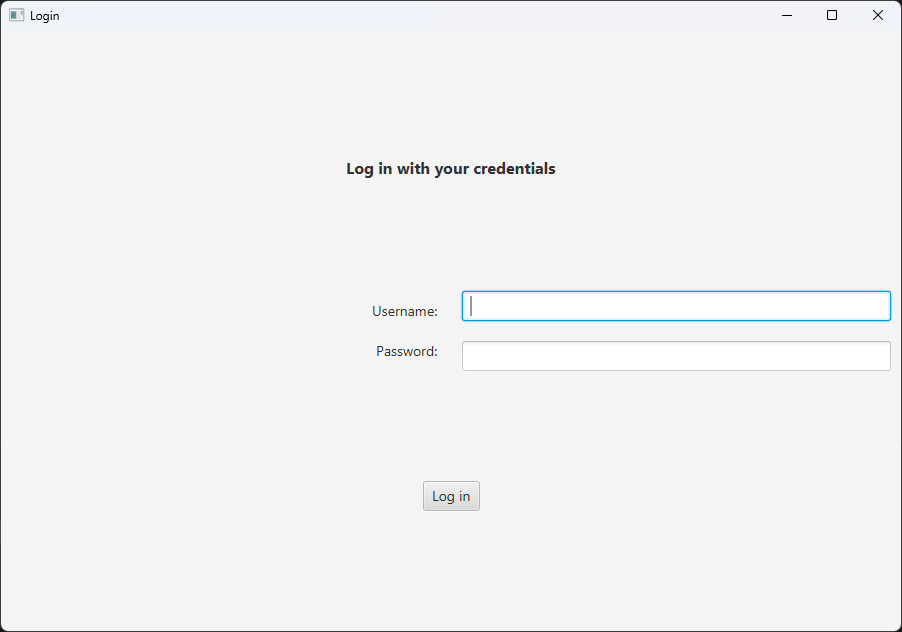
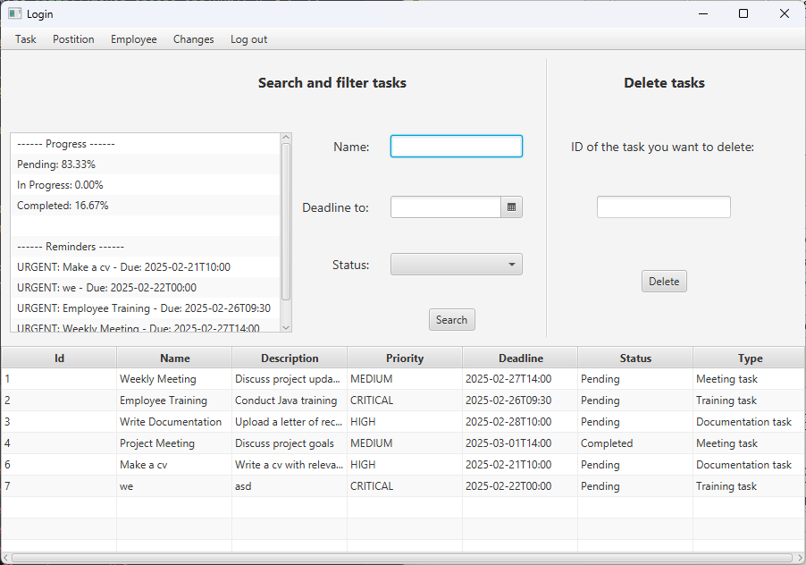
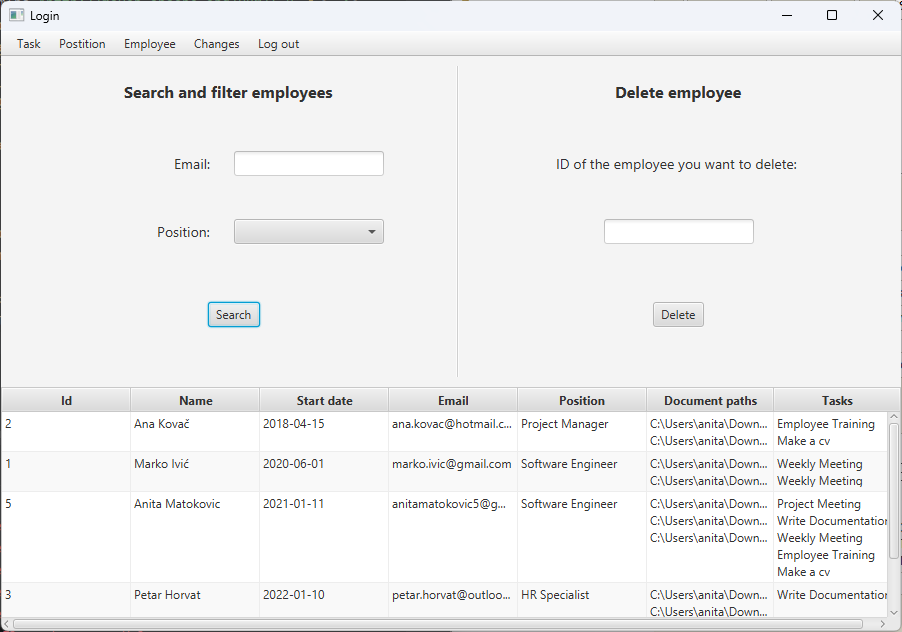
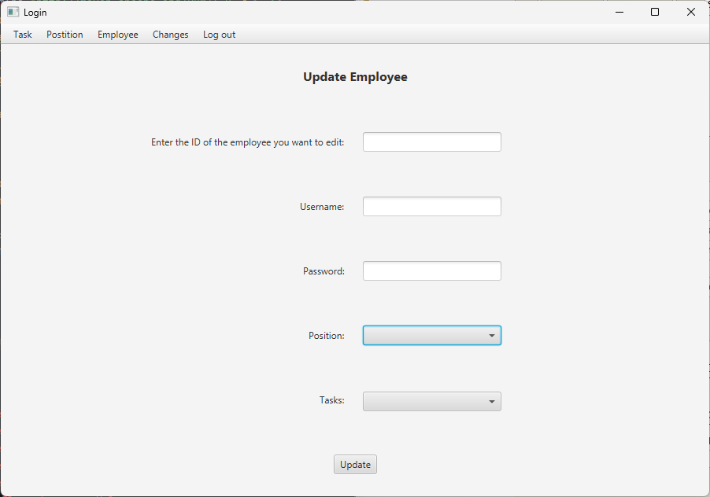
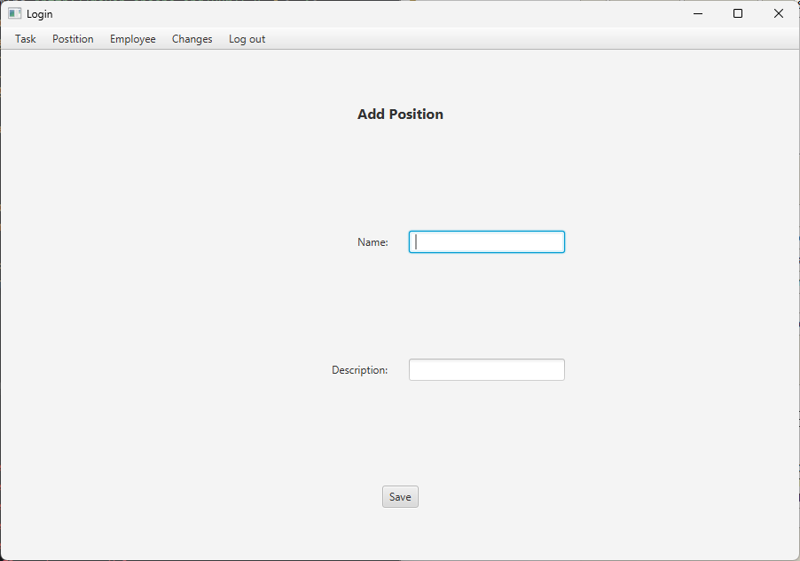
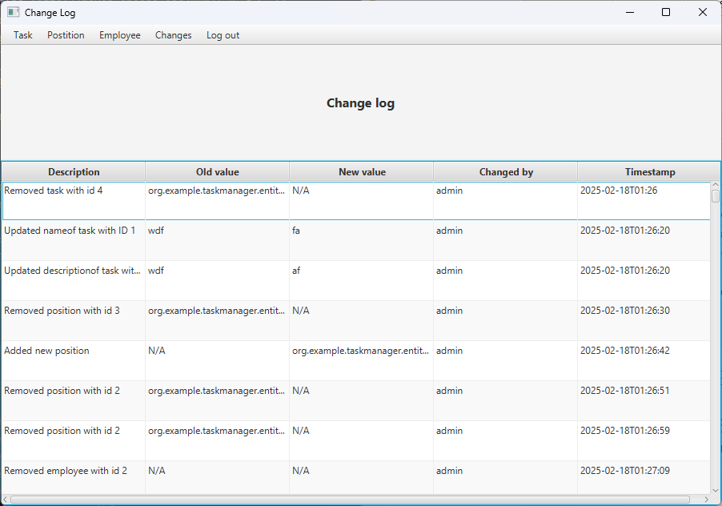
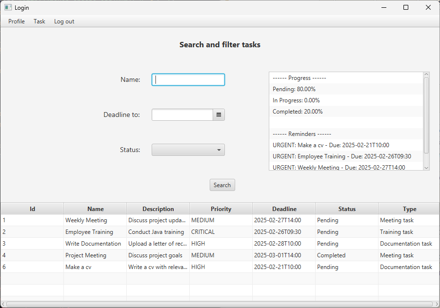

# Employee Onboarding Task Manager

JavaFX desktop application for managing employee onboarding tasks, documents and progress.

Developed as part of the **Programming in Java** course at the University of Applied Sciences Zagreb (TVZ).

The application supports separate admin and user roles, task and employee management, progress tracking, document management and change logging.

---

## Technologies

- Java
- JavaFX
- Maven
- H2 Database
- JDBC
- Logback
- Serialization
- Multithreading
- Object-Oriented Programming

---

## Features

- User authentication with Admin and User roles
- Employee, task and position management
- Search, filtering, adding, updating and deleting records
- Task progress tracking and reminders
- Employee document tracking
- Change log with old value, new value, user and timestamp
- Serialized change history
- Multithreading for task statistics and data processing
- Custom exceptions and application logging with Logback

---

## Screenshots

### Login


### Admin Task Management


### Admin Employee Management


### Update Employee


### Add Position


### Change Log


### User Task Overview


---

## Project Structure

```text
src/main/java/
  controller/        JavaFX controllers
  entity/            Domain models and authentication logic
  repository/        Database access layer
  exception/         Custom exceptions
  serialization/     Change log serialization
  thread/            Multithreading logic
  record/            Java records

src/main/resources/
  *.fxml             JavaFX views
  logback.xml        Logging configuration

database/
  schema.sql         Database schema and sample data

dat/
  admin.txt          Admin credentials
  user.txt           User credentials
```

---

## Running Locally

### 1. Start H2 Database

Start the H2 TCP server and open the H2 Console:

```text
http://localhost:8082
```

Use the following connection settings:

```text
JDBC URL: jdbc:h2:tcp://localhost/~/taskmanager
User Name: student
Password: student
```

### 2. Initialize the Database

Run the SQL script located in:

```text
database/schema.sql
```

### 3. Run the Application

```bash
./mvnw javafx:run
```

On Windows:

```bash
mvnw.cmd javafx:run
```

---

## Demo Login

```text
Admin:
username: admin
password: Admin123

User:
username: anita
password: Anita123
```

---

## Author

Anita Matoković